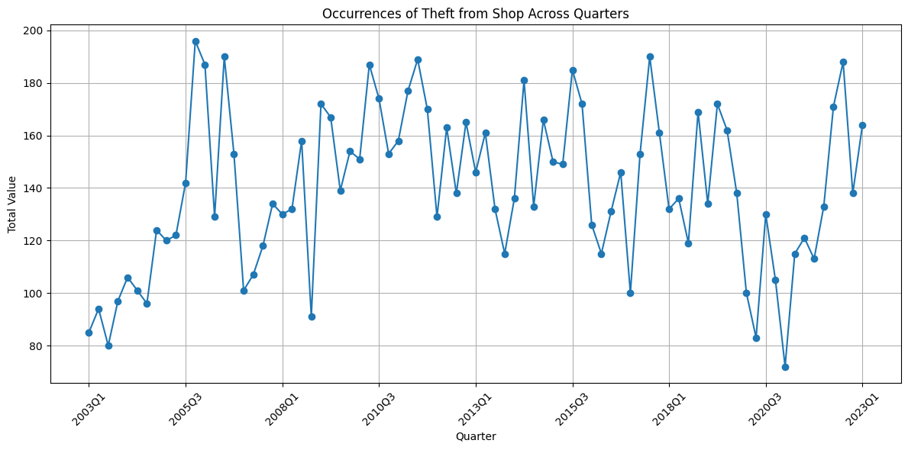
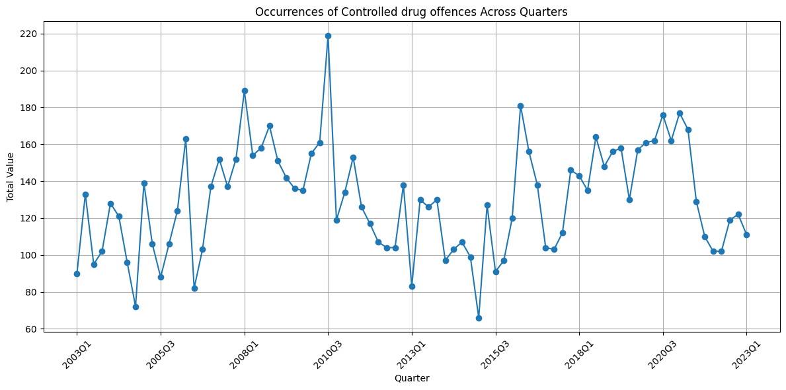
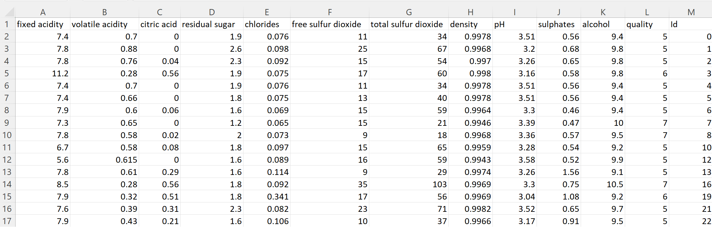
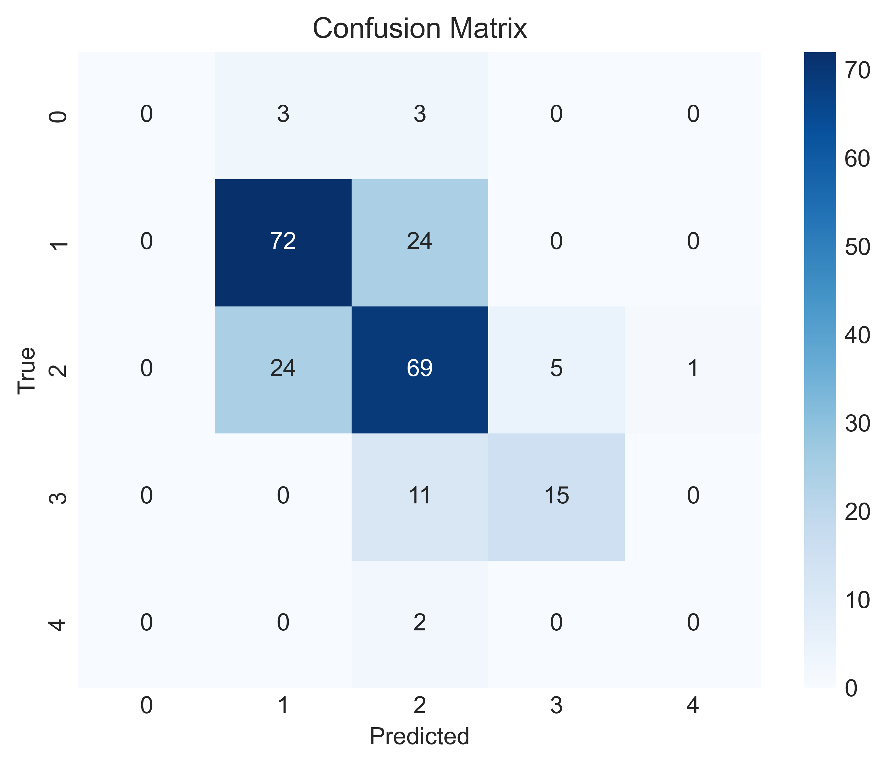

# Data Science Y4 Project Portfolio 

## Portfolio Content  
- [About](#about) 
- [Education](#education)
- [Skills](#skills)
- [Programming Technologies](#programming-technologies) 
- [Data Storage](#data-storage)
- [Professional Projects](#professional-projects)
  - [Irish crime project](#Irish-Crime-Statistics)
  - [Decision Trees and Random Forests](#Decision-Trees-and-Random-Forests)
  - [Project 3](#project-3)
- [Personal Projects](#personal-projects)

- [Certifications](#certifications) 

# About 
Sebastian Firsaev 
Final Year BSc Student SETU Carlow 

Find more information about me here:
- [GitHub](https://github.com/Sebastian-Firsaev)
- [LinkedIn](https://www.linkedin.com/in/sebfirs/)

# Education
- Bachelor of Science in Data Science
  - University Name: [SETU Carlow](https://www.setu.ie/)
  - Graduation Date: 2024

# Skills
* Programming
* Data Analysis
* Data Visualization
* Machine Learning
* Big Data
* Statistical Analysis
* Data Cleaning
* Data Wrangling
* Data Ethics and Privacy
* Data Presentation

# Programming Technologies
* Java
* C++
* Python 3
* HTML
* CSS
* JavaScript
* Jinja2 
* Git 
* Flask

## Data Storage
* Local Machine Storage 
* Cloud Storage (AWS, Google Cloud)
* Github

# Professional Projects 
## Irish Crime Statistics 

 

# Does the univerity in Carlow have an impact on crime in the county?
 
**Introduction:** 
 

This project is based on analysing and predicting Irish crime rates, which is a crucial area of interest in the context of law enforcement, public safety, and societal well-being. The primary objective is to harness data-driven insights to understand and predict future crime trends and find out if the university have a major impact on crime within county Carlow. The dataset under consideration is sourced from www.cso.ie. 

This project aims to offer valuable insights for law enforcement agencies, policymakers, and researchers. It seeks to answer questions related to the distribution of crime, its variation by type, and the potential influence of external factors, such as Universities and employment rates, on criminal tendencies. Understanding these patterns can assist in allocating resources effectively, implementing targeted crime prevention strategies, and enhancing overall public safety as well as demonstrate my knowledge and understanding of data science.
 

**Data sets & Sources**
 
Overview: This dataset contains Irish crime statistics for the years 2003Q1 to 2023Q1.

Data Source: data.gov.ie/cso.ie
https://data.gov.ie/dataset/cjq01-recorded-crime-incidents-under-reservation

Data Structure: The dataset consists of 161,029 rows and five columns

Data Fields:

'Quarter' (Text): Time period in the format "YYYY-QQ."
 
'Garda Division' (Text): Geographic division.
 
'Type of Offence' (Categorical): Categories of criminal offenses.
 
'UNIT' (Text): Number.
 
'VALUE' (Numeric): Number of reported crimes.
 

Usage and License: This dataset is publicly available for research and analysis from the central statistics office.

Sample Records:

Data Format: The dataset is available in Excel, csv, Px and Json-stat.

 

**Background:** 
 
The utility and significance of this portfolio are rooted in its potential to contribute valuable insights and predictions in the field of crime statistics. Accurate, data-driven predictions of crime tendencies by geographic areas hold substantial value for various stakeholders. By using Python, Jupyter Notebook, and Visual Studio Code, it showcases the utility of modern data science tools and technologies. 

**Portfolio Design:** 
 
Tools and Techniques: The project utilizes [Python](https://www.python.org/) as the primary programming language and employs popular data science libraries and frameworks like [Pandas](https://pandas.pydata.org/about/), [Seaborn](https://seaborn.pydata.org/), and [NumPy](https://numpy.org/). These tools enable data manipulation, predictive modeling, and data visualization. 
 

**Technologies Used:** 
 
Technologies: The portfolio incorporates [Jupyter Notebook](https://jupyter.org/) and Visual Studio Code as the primary development environments. Jupyter Notebook facilitates interactive data analysis and report generation, while Visual Studio Code offers a comprehensive coding environment for more extensive data analysis and modeling tasks. All jupyter note books with the code can be found in this github repository.  
 

**Current Progress** 
 
This report presents an exploratory data analysis and visualization of Irish crime statistics. The objective is to gain insights into historical crime trends, focusing on overall crime regardless of type, and to examine how crime varies across different yearly quarters and Garda divisions in Ireland 2003-2023. later focusing on the Carlow/Kilkenny area. This analysis is conducted using Python within a Jupyter Notebook environment.
 

**Exploratory Data Analysis:**

To understand the historical trends of overall crime in Ireland, we initially focus on the distribution of crime by quarter. The following code snippet extracts the data for overall crime by quarter and creates a line plot using the Seaborn library.

**Sample Code:**
 
import pandas as pd
import matplotlib.pyplot as plt
import seaborn as sns

Load data from Excel
 
data = pd.read_excel("Irish crime data.xlsx")
 
Group by Quarter and sum the 'VALUE' column to calculate overall crime
overall_crime = data.groupby('Quarter')['VALUE'].sum().reset_index()
 
plt.figure(figsize=(20, 10))
 
plt.plot(overall_crime['Quarter'], overall_crime['VALUE'], marker='o', linestyle='-', color='b')
 
plt.xlabel('Quarter')
 
plt.ylabel('Overall Crime')
 
plt.title('Overall Crime by Quarter')
 
plt.xticks(rotation=45)
 
plt.grid()
 
plt.show()
 

This initial visualization provides insights into how overall crime has varied over different quarters.

**Further Analysis:**

Continuing the analysis, the focus shifted to examining the distribution of overall crime by Garda Division, as different geographic regions may have varying crime rates. The code below groups the data by Garda Division and calculates the overall crime in each division. It creates a bar plot to visualize these results:

overall_crime_by_division = data.groupby('Garda Division')['VALUE'].sum().reset_index()
 
Create a bar plot to visualize overall crime by Garda Division
 
plt.figure(figsize=(12, 6))
 
plt.bar(overall_crime_by_division['Garda Division'],
 
overall_crime_by_division['VALUE'])
 
plt.xlabel('Garda Division')
 
plt.ylabel('Overall Crime')
 
plt.title('Overall Crime by Garda Division')
 
plt.xticks(rotation=90)
 
plt.grid(axis='y')
 
plt.show()

This visualization allows us to discern how overall crime is distributed among different Garda Divisions in Ireland.

## Crime In Carlow/Kilkenny Garda Division 
To answer the question if students have an impact on crime within Carlow i decided to first breakdown the original dataset to just focus on the Carlow/Kilkenny Garda Division. It is important to note that outside factors can also have an effect of crime, for example Crime rates in carlow can also be affected by the fact that [Kilkenny/Carlow one of only three garda divisions with no current Crime Prevention Officer](https://www.kilkennypeople.ie/news/local-news/1297412/kilkenny-carlow-one-of-only-three-garda-divisions-with-no-crime-prevention-officer.html).   
  
    kilkenny_carlow_data = data[data['Garda Division'] == 'Kilkenny/Carlow Garda Division']
    if not kilkenny_carlow_data.empty:
    # Group data by 'Type of Offence' and sum the 'VALUE' for each type of offense
    offence_values = kilkenny_carlow_data.groupby('Type of Offence')['VALUE'].sum().reset_index()
    if not offence_values.empty:
        # Find the crime with the highest total value in Kilkenny/Carlow Garda Division
        most_valuable_crime = offence_values.loc[offence_values['VALUE'].idxmax()]
        print("The most valuable crime in Kilkenny/Carlow Garda Division is:", most_valuable_crime['Type of Offence'])  
  
  
I found that the most numerous crime was theft. This is also commonly reported in local [news articles](https://www.carlowlive.ie/news/home/1312571/breaking-carlow-hit-by-weekend-crime-spree-as-string-of-burglaries-shake-community.html)
I then filtered for crimes that would be most associated with students "theft from shop and drug offenses". and exported this to a separate dataset file. 

    if not data.empty:
    # Filter the data for 'Theft from shop' and 'Controlled drug offences' in all quarters for all years
    specific_crimes = data[
        ((data['Type of Offence'] == 'Theft from shop') | (data['Type of Offence'] == 'Controlled drug offences'))
    ]
    if not specific_crimes.empty:
        # Group the filtered data by 'Type of Offence' and 'Quarter', then sum the 'VALUE' for each quarter
        total_values = specific_crimes.groupby(['Type of Offence', 'Quarter'])['VALUE'].sum().reset_index()
        # Save the data to a new Excel file
        total_values.to_excel('total_values_crimes.xlsx', index=False)
        print("Data exported to 'total_values_crimes.xlsx' successfully.")
        
The following graphs show the number of occurrences of these crimes: 

Since quarter3 is the summer month when students are off and most likely back intheirr home counties, i wanted to check if there is a major difference in crimes between Q3 and the rest of the year. especially in contrast to Q4 when all the students are back from the summer break.

    import pandas as pd
    if not data.empty:
    # Filter the data for 'Theft from shop'
    theft_from_shop = data[data['Type of Offence'] == 'Theft from shop']

    if not theft_from_shop.empty:
        # Extract year and quarter separately from the 'Quarter' column
        theft_from_shop['Year'] = theft_from_shop['Quarter'].str[:4]
        theft_from_shop['Quarter'] = theft_from_shop['Quarter'].str[-2:]

        # Convert the 'Value' column to numeric if needed
        theft_from_shop['Value'] = pd.to_numeric(theft_from_shop['VALUE'])

        # Pivot the table to have quarters as columns and sum the values for each quarter of each year
        theft_pivot = theft_from_shop.pivot_table(index='Year', columns='Quarter', values='Value', aggfunc='sum')

        # Check for years where Q2 was lower than Q3
        lower_q2_than_q3_years = theft_pivot[(theft_pivot['Q3'] < theft_pivot['Q4'])].index.tolist()
        print("Years where Q3 was lower than Q4 for 'Theft from Shop':", lower_q2_than_q3_years)
        
        
I found that for both drug offenses and theft, the crime rate when all the students are back did not significantly increase year by year, in fact in theft was lower in quarter 4 in the majority of years (11/20)
however drug related offenses were higher in quarter 4 (11/20).
I am unable to make a significant conclusion at this time, however it seems that student have a small effect on the overall crime rate for carlow. 
 
**Planned Progression**

Predict future crime rates by county in Ireland using historical crime data.
 
explore the type of, and possible (Covid related) reasons behind the sharp increase in crime between 2020Q4 and 2022Q3.
  

Cross-reference crime predictions with employment statistics to identify potential correlations:

Second Data set: FY056B - Rates for Labour Force Participation and Unemployment 

Source: data.gov.ie
https://data.gov.ie/dataset/fy056b-rates-for-labour-force-participation-and-unemployment

Data Structure: The dataset consists of 15625 rows and eight columns, 'Statistic Label', 'Census Year', 'County and City', 'Detailed Marital', 'Status', 'Age Group', 'Sex', 'UNIT', 'VALUE'. 

Usage and License: This dataset is publicly available for research and analysis from the central statistics office.

Sample Records:

Possible challenges: The crime dataset includes data for individual years, while the labor force dataset only provides data for specific census years. Aligning the datasets temporally for direct comparisons might be challenging.

## Project 2 - Decision Trees and Random Forests
- All code for this project is not my own and is being used for learning purposes. Source can be found here: https://github.com/jakevdp/PythonDataScienceHandbook/blob/master/notebooks/05.08-Random-Forests.ipynb
### Introduction
This project focuses on the comprehensive exploration of decision trees and random forests. It offers an educational journey into their workings and applications. Through practical implementations using Scikit-Learn in Python, I'll cover decision tree visualization, the challenge of overfitting, the concept of ensemble methods, and the versatility of random forests in classification and regression tasks. I aim to uncover the intricacies, strengths, and practical implications of decision trees and random forests in the realm of machine learning.

### Code errors 
Fixing the code from the original workbook. The code from the original workbook is using an outdated version of Python, so before starting i must resolve the errors:

    %matplotlib inline  
    import numpy as np 
    import matplotlib.pyplot as plt 
    plt.style.use('seaborn-whitegrid') 

The above code showed an error because seaborn-whitegrid seems to no longer be available, as it was updated to v0_8-whitegrid. so i changed the style to this.

After studying the above decision trees and random forests, and recreating that workbook. I decided to create a mini project based on this information.

### Project 2.1 - wine quality 
Source - https://www.kaggle.com/datasets/yasserh/wine-quality-dataset/

Wine Quality Prediction Using Random Forest Classifier
Objective: The objective of this mini project was to create a predictive model to classify the quality of wines based on certain features using a Random Forest Classifier.
#### Data  
The dataset was explored and displayed using the following imported libraries: [Matplotlib](https://matplotlib.org/), Seaborn,[Pandas](https://pandas.pydata.org/about/), [Seaborn](https://seaborn.pydata.org/), [NumPy](https://numpy.org/) and [Scikit-Learn](https://scikit-learn.org/stable/). 

The dataset ('wineQT.csv') was loaded into a Pandas DataFrame. The target variable was identified as “quality”. The data was features X and the target variable y, dropping the 'quality' column from the features. And a train-test split (80-20) was made to create training and testing datasets.

#### Random Forest Classifier 
I utilized a Random Forest Classifier with 100 decision trees to build the predictive model and trained the it on the training dataset using fit(). Predictions were generated on the test set using the trained model (predict()). A classification report displaying precision, recall, and F1-score for each class of wine quality was generated. Then I created a confusion matrix to visualize the model's performance in predicting different wine quality levels, This was displayed using Seaborn

#### Results

The Classification Report provides insights into the model's performance for each class (wine quality levels 4, 5, 6, 7, and 8).
*	F1-score: The harmonic mean of precision and recall, offering a balanced measure between the two.
*	Precision: The proportion of correctly predicted instances among the predicted instances for each class.
*	Recall: The proportion of correctly predicted instances among the actual instances for each class.

Confusion Matrix Visualization shows:
*	True Positives, True Negatives, False Positives, and False Negatives for each class.
*	Highlights areas where the model excels or struggles in predicting certain wine quality levels.

#### Summary and Conclusion:
*	The overall accuracy of the model is 68%, with noticeable variances in performance across different wine quality classes. The model seems to perform well in predicting wine quality levels 5 and 6 but struggles with quality levels 4, 7, and 8, as indicated by lower performance metrics and accuracy.

## Project 3
- **Introduction:** Clear problem statement and context.
- **Background:** Justification of portfolio’s utility & significance.
- **Proposed Portfolio Design:** Content of the portfolio includes data sets, tools, techniques, technologies, ethics, regulations, GDPR, etc.
- **Opportunities & Challenges:** 
- **Methodology:** Describe the approach taken.
- **Technologies Used:** List the technologies utilized.
- **Data Sets:** Mention the data sources.
- **Challenges:** Highlight any difficulties encountered.

# Personal Projects 
- **Introduction:** Clear problem statement and context.
- **Background:** Justification of portfolio’s utility & significance.
- **Proposed Portfolio Design:** Content of the portfolio includes data sets, tools, techniques, technologies, ethics, regulations, GDPR, etc.
- **Opportunities & Challenges:** 
- **Methodology:** Describe the approach taken.
- **Technologies Used:** List the technologies utilized.
- **Data Sets:** Mention the data sources.
- **Challenges:** Highlight any difficulties encountered.

# Certifications  
- Certification Name
  - Issuing Organization
  - Date of Certification

