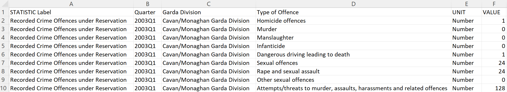
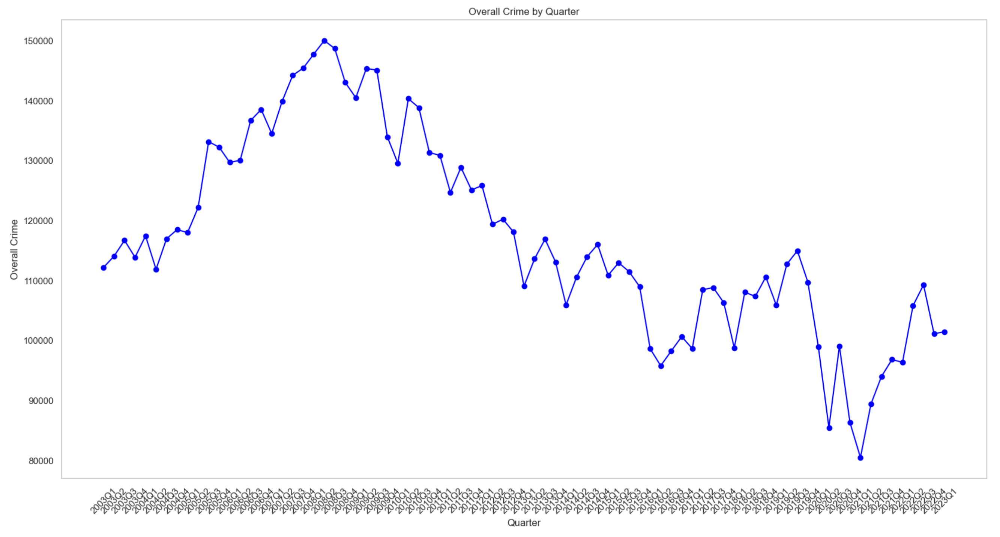
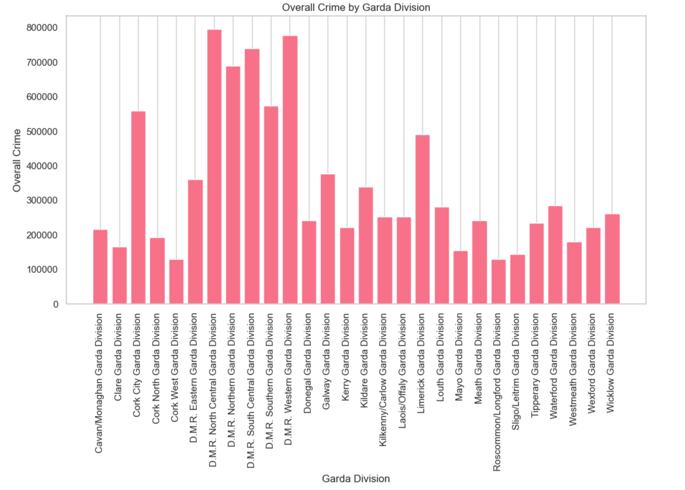
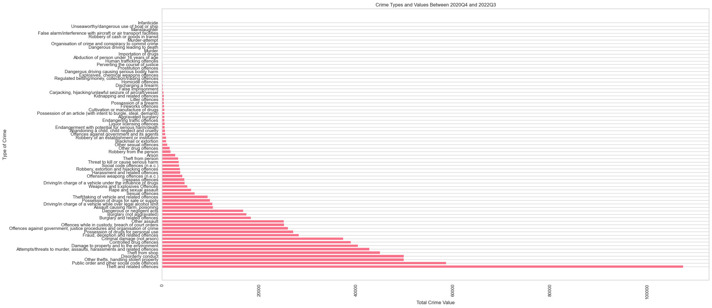
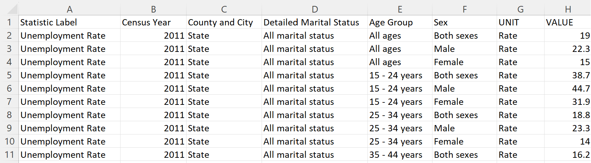

# Data Science Y4 Project Portfolio 

## Portfolio Content  
- [About](#about) 
- [Education](#education)
- [Skills](#skills)
- [Programming Technologies](#programming-technologies) 
- [Data Storage](#data-storage)
- [Professional Projects](#professional-projects)
  - [Irish crime project](#Irish-Crime-Statistics)
  - [Project 2](#project-2)
  - [Project 3](#project-3)
- [Personal Projects](#personal-projects)

- [Certifications](#certifications) 

# About 
Sebastian Firsaev 
Final Year BSc Student SETU Carlow 

Find more information about me here:
- [GitHub](https://github.com/Sebastian-Firsaev)
- [LinkedIn](https://www.linkedin.com/in/sebfirs/)

# Education
- Bachelor of Science in Data Science
  - University Name: SETU Carlow
  - Graduation Date: 2024

# Skills
* Programming
* Data Analysis
* Data Visualization
* Machine Learning
* Big Data
* Statistical Analysis
* Data Cleaning
* Data Wrangling
* Data Ethics and Privacy
* Data Presentation

# Programming Technologies
* Java
* C++
* Python 3
* HTML
* CSS
* JavaScript
* Jinja2 
* Git 
* Flask

## Data Storage
* Local Machine Storage 
* Cloud Storage (AWS, Google Cloud)
* Github

# Professional Projects 
## Irish Crime Statistics 
**The question** 
Does the univerity in Carlow have an impact on crime in the county?
**Introduction:** 
 

This project is based on analysing and predicting Irish crime rates, which is a crucial area of interest in the context of law enforcement, public safety, and societal well-being. The primary objective is to harness data-driven insights to understand and predict future crime trends by geographic areas in Ireland. The dataset under consideration is sourced from www.cso.ie. 

This project aims to offer valuable insights for law enforcement agencies, policymakers, and researchers. It seeks to answer questions related to the distribution of crime, its variation by type, and the potential influence of external factors, such as employment rates, on criminal tendencies. Understanding these patterns can assist in allocating resources effectively, implementing targeted crime prevention strategies, and enhancing overall public safety as well as demonstrate my knowledge and understanding of data science.
 

**Data sets & Sources**
 
Overview: This dataset contains Irish crime statistics for the years 2003Q1 to 2023Q1.

Data Source: data.gov.ie/cso.ie
https://data.gov.ie/dataset/cjq01-recorded-crime-incidents-under-reservation

Data Structure: The dataset consists of 161,029 rows and five columns

Data Fields:

'Quarter' (Text): Time period in the format "YYYY-QQ."
 
'Garda Division' (Text): Geographic division.
 
'Type of Offence' (Categorical): Categories of criminal offenses.
 
'UNIT' (Text): Number.
 
'VALUE' (Numeric): Number of reported crimes.
 

Usage and License: This dataset is publicly available for research and analysis from the central statistics office.

Sample Records:

Data Format: The dataset is available in Excel, csv, Px and Json-stat.

 

**Background:** 
 
The utility and significance of this portfolio are rooted in its potential to contribute valuable insights and predictions in the field of crime statistics. Accurate, data-driven predictions of crime tendencies by geographic areas hold substantial value for various stakeholders. By using Python, Jupyter Notebook, and Visual Studio Code, it showcases the utility of modern data science tools and technologies. 

**Portfolio Design:** 
 
Tools and Techniques: The project utilizes Python as the primary programming language and employs popular data science libraries and frameworks like Pandas, NumPy, and Seaborn. These tools enable data manipulation, predictive modeling, and data visualization.
 

**Technologies Used:** 
 
Technologies: The portfolio incorporates Jupyter Notebook and Visual Studio Code as the primary development environments. Jupyter Notebook facilitates interactive data analysis and report generation, while Visual Studio Code offers a comprehensive coding environment for more extensive data analysis and modeling tasks.
 

**Current Progress** 
 
This report presents an exploratory data analysis and visualization of Irish crime statistics. The objective is to gain insights into historical crime trends, focusing on overall crime regardless of type, and to examine how crime varies across different yearly quarters and Garda divisions in Ireland 2003-2023. This analysis is conducted using Python within a Jupyter Notebook environment.
 

**Exploratory Data Analysis:**

To understand the historical trends of overall crime in Ireland, we initially focus on the distribution of crime by quarter. The following code snippet extracts the data for overall crime by quarter and creates a line plot using the Seaborn library.

**Sample Code:**
 
import pandas as pd
import matplotlib.pyplot as plt
import seaborn as sns

Load data from Excel
 
data = pd.read_excel("Irish crime data.xlsx")
 
Group by Quarter and sum the 'VALUE' column to calculate overall crime
overall_crime = data.groupby('Quarter')['VALUE'].sum().reset_index()
 
plt.figure(figsize=(20, 10))
 
plt.plot(overall_crime['Quarter'], overall_crime['VALUE'], marker='o', linestyle='-', color='b')
 
plt.xlabel('Quarter')
 
plt.ylabel('Overall Crime')
 
plt.title('Overall Crime by Quarter')
 
plt.xticks(rotation=45)
 
plt.grid()
 
plt.show()
 

This initial visualization provides insights into how overall crime has varied over different quarters.

**Further Analysis:**

Continuing the analysis, the focus shifted to examining the distribution of overall crime by Garda Division, as different geographic regions may have varying crime rates. The code below groups the data by Garda Division and calculates the overall crime in each division. It creates a bar plot to visualize these results:

overall_crime_by_division = data.groupby('Garda Division')['VALUE'].sum().reset_index()
 
Create a bar plot to visualize overall crime by Garda Division
 
plt.figure(figsize=(12, 6))
 
plt.bar(overall_crime_by_division['Garda Division'],
 
overall_crime_by_division['VALUE'])
 
plt.xlabel('Garda Division')
 
plt.ylabel('Overall Crime')
 
plt.title('Overall Crime by Garda Division')
 
plt.xticks(rotation=90)
 
plt.grid(axis='y')
 
plt.show()

This visualization allows us to discern how overall crime is distributed among different Garda Divisions in Ireland.

**Planned Progression**

Predict future crime rates by county in Ireland using historical crime data.
 
explore the type of, and possible (Covid related) reasons behind the sharp increase in crime between 2020Q4 and 2022Q3.
  

Cross-reference crime predictions with employment statistics to identify potential correlations:

Second Data set: FY056B - Rates for Labour Force Participation and Unemployment 

Source: data.gov.ie
https://data.gov.ie/dataset/fy056b-rates-for-labour-force-participation-and-unemployment

Data Structure: The dataset consists of 15625 rows and eight columns, 'Statistic Label', 'Census Year', 'County and City', 'Detailed Marital', 'Status', 'Age Group', 'Sex', 'UNIT', 'VALUE'. 

Usage and License: This dataset is publicly available for research and analysis from the central statistics office.

Sample Records:

Possible challenges: The crime dataset includes data for individual years, while the labor force dataset only provides data for specific census years. Aligning the datasets temporally for direct comparisons might be challenging.

## Project 2
- **Introduction:** Clear problem statement and context.
- **Background:** Justification of portfolio’s utility & significance.
- **Proposed Portfolio Design:** Content of the portfolio includes data sets, tools, techniques, technologies, ethics, regulations, GDPR, etc.
- **Opportunities & Challenges:** 
- **Methodology:** Describe the approach taken.
- **Technologies Used:** List the technologies utilized.
- **Data Sets:** Mention the data sources.
- **Challenges:** Highlight any difficulties encountered.

## Project 3
- **Introduction:** Clear problem statement and context.
- **Background:** Justification of portfolio’s utility & significance.
- **Proposed Portfolio Design:** Content of the portfolio includes data sets, tools, techniques, technologies, ethics, regulations, GDPR, etc.
- **Opportunities & Challenges:** 
- **Methodology:** Describe the approach taken.
- **Technologies Used:** List the technologies utilized.
- **Data Sets:** Mention the data sources.
- **Challenges:** Highlight any difficulties encountered.

# Personal Projects 
- **Introduction:** Clear problem statement and context.
- **Background:** Justification of portfolio’s utility & significance.
- **Proposed Portfolio Design:** Content of the portfolio includes data sets, tools, techniques, technologies, ethics, regulations, GDPR, etc.
- **Opportunities & Challenges:** 
- **Methodology:** Describe the approach taken.
- **Technologies Used:** List the technologies utilized.
- **Data Sets:** Mention the data sources.
- **Challenges:** Highlight any difficulties encountered.

# Certifications  
- Certification Name
  - Issuing Organization
  - Date of Certification

